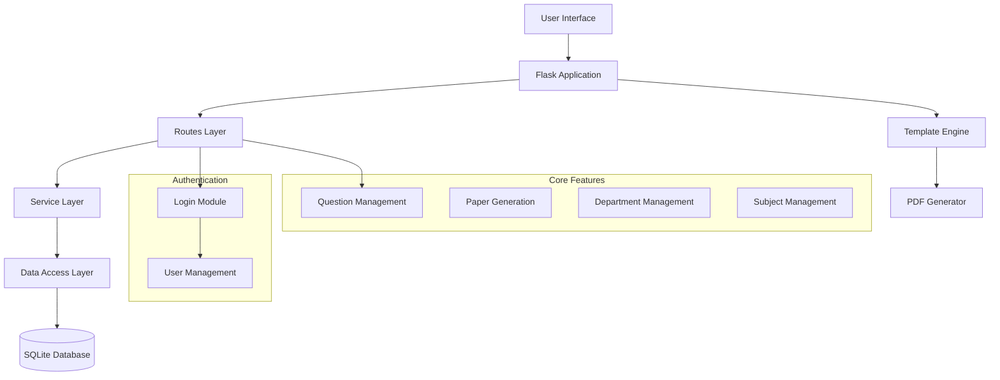
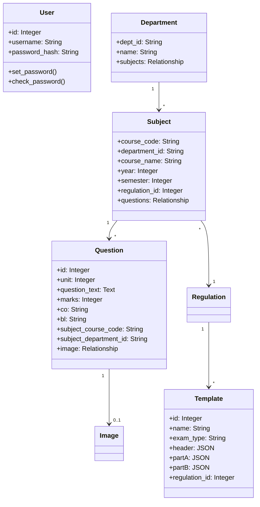
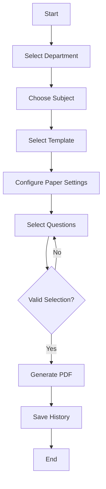
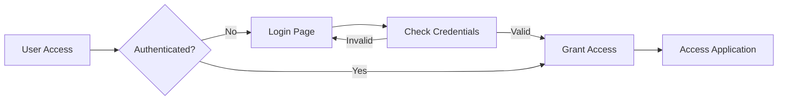
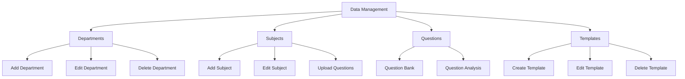
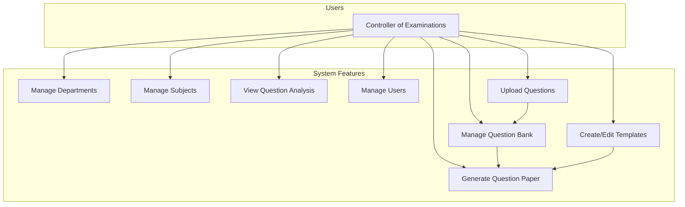

# Question Paper Generator System Architecture

## 1. System Architecture

## 2. Class Diagram

## 3. Question Generation Flow

## 4. Authentication Flow

## 5. Data Management Module

## 6. Use Case Diagram

