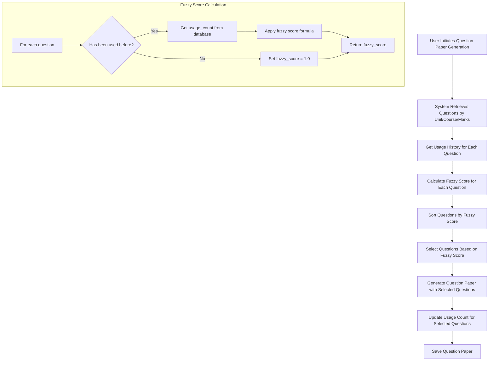

# Fuzzy Logic Sequence Flow

This document describes the flow of the fuzzy logic sequence and how it is applied in the automated question selection process within the Question Paper Generator application.



The formula used for fuzzy score calculation is:
```
fuzzy_score = 1.0 / sqrt(1.0 + log10(usage_count))
```

## Step-by-Step Flow Explanation

1. **Initiation**:
   - The process starts when a user initiates question paper generation.
   - The user selects a template, subject, and exam type.

2. **Question Filtering**:
   - The system retrieves eligible questions based on:
     - Unit number
     - Course code
     - Department ID
     - Required marks
     - Other filtering criteria

3. **Usage History Retrieval**:
   - For each eligible question, the system queries the `SelectedQuestion` table.
   - It retrieves the total usage count across previous question papers.
   - Questions never used before have a usage count of 0.

4. **Fuzzy Score Calculation**:
   - The fuzzy score is calculated using the formula:
     ```
     fuzzy_score = 1.0 / sqrt(1.0 + log10(usage_count))
     ```
   - Questions never used before receive the highest possible score of 1.0.
   - Higher usage counts result in lower fuzzy scores, but the decline is logarithmic to ensure questions remain viable.

5. **Question Sorting**:
   - Questions are sorted in descending order of fuzzy scores.
   - Questions with the highest fuzzy scores (least frequently used) appear first.
   - Ties are broken by question ID to ensure consistent ordering.

6. **Automated Selection Process**:
   - The system can select questions automatically based on fuzzy scores.
   - In automated selection, the system:
     1. Prioritizes questions with higher fuzzy scores
     2. Ensures selection of required question types and marks
     3. Maintains diversity in selected questions

7. **Selection Tracking**:
   - Once questions are selected for a paper:
     - If a question was previously used, its usage count is incremented.
     - If a question is used for the first time, a new record is created with usage_count = 1.
     - The selection date is updated to the current timestamp.

8. **Feedback Loop**:
   - The selection process creates a feedback loop:
     - Questions used frequently receive lower fuzzy scores
     - Lower-scored questions become less likely to be selected
     - This gradually encourages the system to use other, less-used questions
     - Over time, all questions get a fair chance of being selected

## Implementation in Code

The fuzzy logic flow is primarily implemented in two key locations:

1. **Question Retrieval API** (`/get_questions` route):
   - Calculates fuzzy scores for questions when `apply_fuzzy=true` parameter is provided
   - Sorts questions by fuzzy score
   - Returns the sorted question list with fuzzy scores

2. **Question Paper Generation** (`/generate_paper` route):
   - When automated selection is used, it leverages the fuzzy scores from the API
   - Selects questions based on their fuzzy score ranking
   - Updates usage counts in the database for selected questions

## Technical Implementation Details

### Database Schema Support

The `SelectedQuestion` model tracks:
- `question_id`: The selected question
- `subject_course_code` and `subject_department_id`: The subject context
- `exam_type`: The type of exam (CIE-I, CIE-II, SEE, etc.)
- `selection_date`: When the question was last selected
- `usage_count`: How many times the question has been used

### Selection Logic Implementation

The JavaScript implementation in the frontend uses the fuzzy scores returned by the API to prioritize questions during automated selection, helping ensure that less-frequently used questions are preferred while maintaining the educational requirements of the paper.
